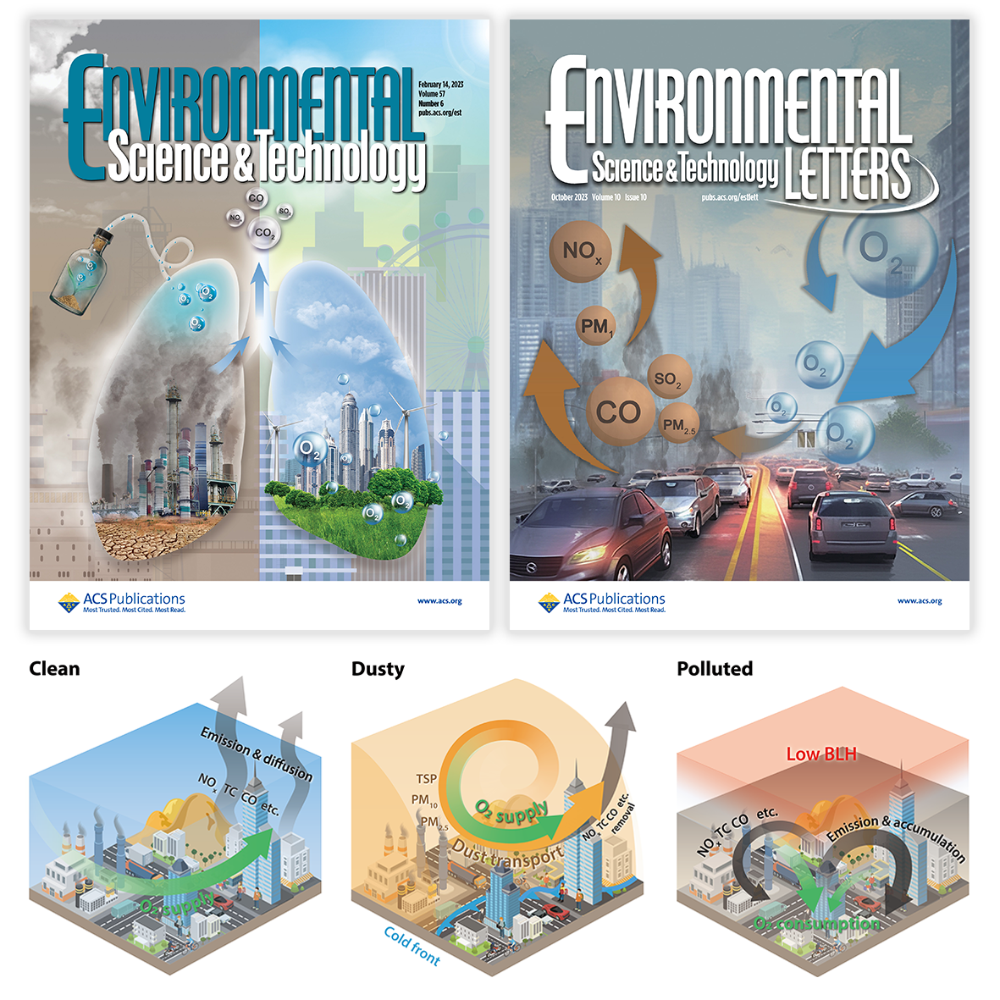
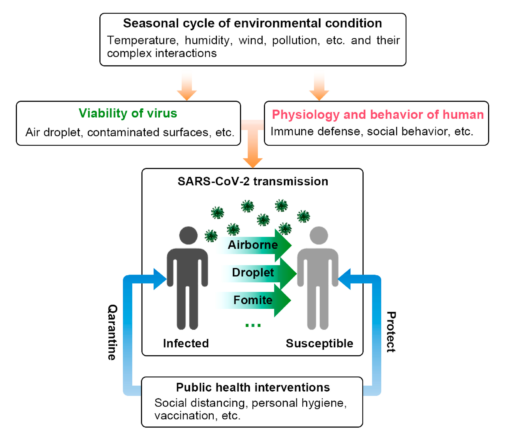








# ✨ Research (Last updated on 2023.11.19)

## Understanding factors driving the O2 variation in urban atmosphere (2019 ~ now)

- **Backgrounds**: Urban regions are the largest sinks of atmospheric O2, yet long-term high-precision O2 measurements in urban regions are currently lacking. I used process-driven and data-driven models to explore urban atmospheric O2 budget in Lanzhou, a city in semi-arid region.
- **Findings**:
  - In densely populated urban regions, resident respiration could make non-negligible contributions (27.50% to 33.08%) to the observed fluctuations in urban O2 variability ([Liu et al., <em>ES&T</em>, 2023](https://pubs.acs.org/doi/10.1021/acs.est.2c07583)).
  - Complex contributions of natural and anthropogenic factors to atmospheric O2 in a semi-arid downtown are explored using explainable machine learning model ([Liu et al., <em>ES&T Letters</em>, 2023](https://pubs.acs.org/doi/10.1021/acs.estlett.3c00505)).

## How does seasonality influence the dynamics of COVID-19 transmission? (2020~2021)

- **Findings**: COVID-19 seasonality is quantified using a refined SEIR epidemic model intergrated with seasonality.
  - COVID-19 seasonality exhibits a more pronounced pattern at higher latitudes, where larger seasonal amplitudes of environmental indicators are observed.
  - 40–60% of COVID-19 cases are associated with seasonality. However, seasonality alone is not sufficient to fully curb the transmission of COVID-19.
- **Impact**: In close collaboration with epidemiologists, this work ([Liu et al., <em>Environ. Res.</em>, 2021]( https://doi.org/10.1016/j.envres.2021.110874)) has received citations from prestigious journals such as [<em>Nature Medicine</em>](https://www.nature.com/articles/s41591-021-01303-y), [<em>the Lancet Public health</em>](https://www.thelancet.com/journals/lanpub/article/PIIS2468-2667(22)00001-9/fulltext). It has also been recognized as an [**ESI highly cited paper**](https://www.webofscience.com/wos/woscc/full-record/WOS:000639328800153).